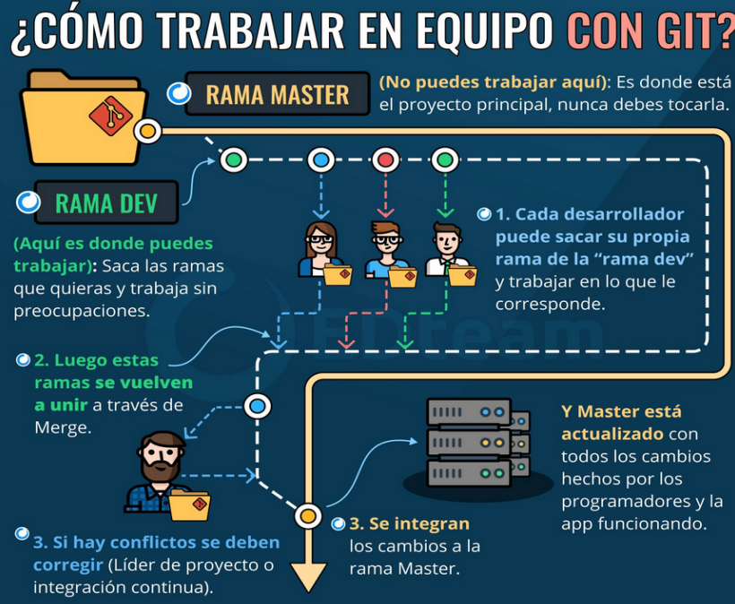

# Tarea de GitHub 2

## Objetivo

Organizar un equipo de trabajo para desarrollar un proyecto colaborativo utilizando Git y GitHub. Cada miembro del equipo implementará una o dos funcionalidades, generando Pull Requests (PR) que se fusionarán en una rama de desarrollo antes de ser incorporadas a la rama principal.

Este ejercicio abarca la gestión de repositorios, la colaboración entre miembros, la resolución de conflictos en Git y la fusión de ramas.

## Pasos a seguir

1. **Formar el equipo**:
   - Organiza a los miembros del grupo y designa a uno como responsable del proyecto.

2. **Crear un repositorio remoto**:
   - Crea un repositorio en GitHub para el proyecto.
   - Agrega a los demás miembros del grupo como colaboradores del repositorio.

3. **Establecer una rama dev**:
   - Clona el repositorio remoto en tu máquina local.
   - Crea una rama llamada `dev` a partir de la rama principal (`main`):
     ```
     git checkout -b dev
     ```

4. **Implementar funcionalidades**:
   - Cada miembro del grupo debe implementar una o dos funcionalidades en su propia rama. 
   - Por ejemplo, si tú eres el miembro 1, crea una rama llamada `funcionalidad1`:
     ```
     git checkout -b funcionalidad1
     ```
   - Realiza cambios en el código (puedes utilizar el ejemplo de código HTML+JS proporcionado en el apartado **Anexo**).

5. **Crear Pull Requests (PR)**:
   - Una vez que hayas completado tu funcionalidad, haz un commit y sube tu rama al repositorio remoto:
     ```
     git add .
     git commit -m "Implementa funcionalidad 1"
     git push origin funcionalidad1
     ```
   - En GitHub, crea un Pull Request desde tu rama (`funcionalidad1`) hacia la rama `dev`.

6. **Resolver conflictos (si los hay)**:
   - Simula un conflicto realizando cambios en la misma línea de un archivo desde otra rama (por otro miembro del equipo) y luego intenta fusionar.
   - Resuelve el conflicto utilizando `git merge` y editando los archivos en conflicto.

7. **Pull local de modificaciones recientes**:
   - Asegúrate de tener la última versión de la rama `dev` en tu máquina local:
     ```
     git pull origin dev
     ```

8. **Fusión de ramas**:
   - Una vez que todas las PR hayan sido revisadas y aprobadas por el responsable, fusiona la rama `dev` en la rama principal (`main`):
     ```
     git checkout main
     git merge dev
     ```

Al completar estos pasos, habrás experimentado con la colaboración efectiva en un proyecto utilizando Git y GitHub, manejando tanto las fusiones exitosas como la resolución de conflictos.

**Flujo de trabajo en git**




**Anexo**

A continuación, se presenta unos códigos de ejemplo para utilizar en la práctica.

```html
<!DOCTYPE html>
<html lang="es-ES">

<head>
    <meta charset="UTF-8">
    <title>Edad del usuario</title>
    <script src="edad.js"></script>
</head>

</html>
```

```js
let edad = prompt("Por favor, introduce a túa idade:");
edad = parseInt(edad);

if (isNaN(edad)) {
  alert("Por favor, introduce un número válido para a idade.");
} else {
  let categoria;

  switch (true) {
    case edad >= 0 && edad <= 12:
      categoria = "neno";
      break;
    case edad >= 13 && edad <= 18:
      categoria = "adolescente";
      break;
    case edad >= 19 && edad <= 30:
      categoria = "xoven";
      break;
    case edad >= 31 && edad <= 64:
      categoria = "adulto";
      break;
    case edad >= 65 && edad <= 100:
      categoria = "xubilado";
      break;
    default:
      alert("Idade fora do rango permitido.");
  }

  if (categoria) {
    alert("Eres un " + categoria + ".");
  }
}

```